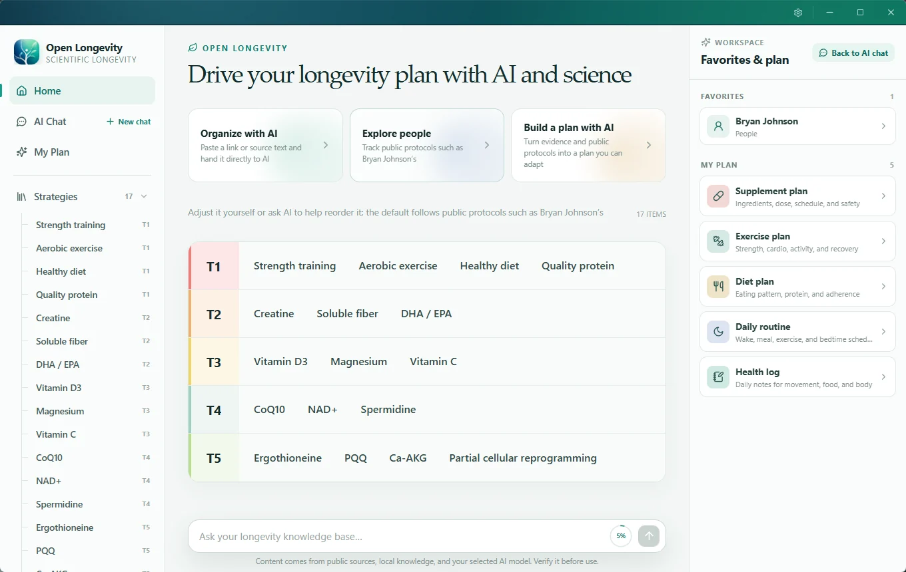
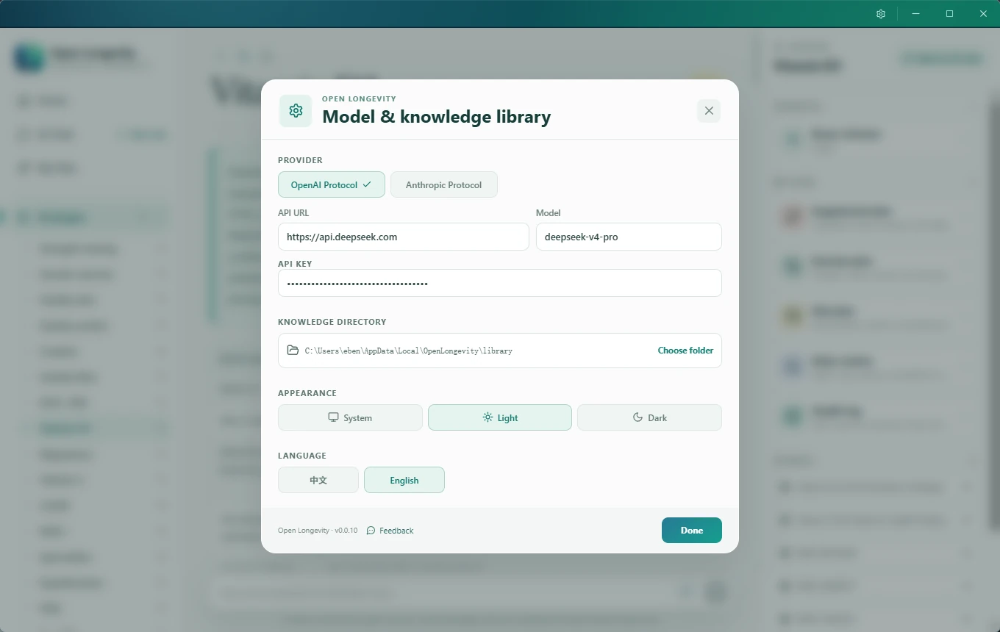

<p align="center">
  
</p>

<h1 align="center">Open Longevity(开源延寿)</h1>

<p align="center">
  <strong>Longevity science should not be reserved for the wealthy.</strong><br>
  Open Longevity takes Bryan Johnson’s longevity plan as a starting blueprint.
</p>

<p align="center">
  <strong>English</strong> · <a href="README.zh-CN.md">简体中文</a>
</p>

<p align="center">
  Windows · macOS · Linux · <a href="https://github.com/edison7009/OpenLongevity/releases/latest"><strong>Download latest</strong></a> · <a href="https://openlongevity.life/">Website</a>
</p>

> Wealth can buy private medical teams, continuous measurement, research support, and rapidly evolving personal protocols.<br>
> Everyone should have the tools to understand evidence, manage personal knowledge, and benefit from responsible AI.

Open Longevity turns scattered papers, public protocols, and personal notes into a workspace that people can read, inspect, grow, and control. It does not sell an immortality shortcut, and it does not suggest copying an expensive protocol blindly. It offers a transparent, traceable, local-first foundation for learning about longevity science.

## Why Open Longevity

Longevity science has a serious access gap:

- New research, testing, and interventions often reach high-net-worth users first.
- Useful information is scattered across papers, podcasts, news, social media, and public protocols.
- It is difficult to separate evidence, inference, marketing, and personal experience.
- General-purpose AI rarely understands the knowledge a user has accumulated over time.
- Health data is deeply personal and should not be locked into a platform by default.

Our principles:

1. **Open knowledge** — Markdown and CSV instead of a closed data silo.
2. **Traceable evidence** — Keep sources, limitations, and unresolved questions visible.
3. **Open-source tools** — Let people inspect and improve the product and its safety boundaries.
4. **Local first** — Keep the library and AI provider configuration on the user's computer.
5. **AI in service of people** — Help users organize and understand; never replace clinical judgment.

## What it can do today

### Read an open bilingual longevity library

- Ships with **84 Chinese documents and 84 maintained English companions**.
- Covers strength training, aerobic exercise, healthy diet, creatine, Omega-3, vitamins, NAD+, and more.
- Includes trackable public cases such as Bryan Johnson and cultural longevity observations.
- Presents a T1–T5 map for navigating priority and evidence maturity.
- Supports internal note links, external references, and favorites.

T1–T5 is a starting framework for reading and discussion—not a medical ranking for every person.

### Organize webpages and source material with AI

Paste a public webpage, paper abstract, article text, or rough note. Open Longevity can:

1. Extract readable webpage content.
2. Ask your configured OpenAI-compatible model for a structured Markdown draft.
3. Surface key findings, limitations, and items that still need verification.
4. Let you review and edit the title and content.
5. Save the approved note into the local `inbox/`.

The capture flow limits download size and duration and blocks access to localhost and private-network addresses.

## Product preview

### Home and the longevity strategy map



### Model and local knowledge library



### Ask AI against your own local notes

AI context is prioritized in this order:

1. The note currently open.
2. Personal profile, current protocol, and records.
3. Relevant notes retrieved from the local library.
4. General model knowledge.

When an answer depends on local material, the assistant is instructed to preserve the corresponding note path for further inspection.

For evidence-oriented questions, Open Longevity can also build a concise
English biomedical query that excludes personal identifiers and retrieve a small live snapshot from PubMed,
ClinicalTrials.gov, and bioRxiv. The answer receives deterministic PMID, NCT,
and preprint links and must distinguish papers, trial registrations/results,
and non-peer-reviewed preprints.

### Keep control of your data

- The default library is independent and never binds to a developer's private notes.
- Markdown and CSV remain portable, readable, and easy to back up.
- The complete AI provider configuration, including the API key, is stored as
  plaintext JSON in the current user's local app-data directory at
  `OpenLongevity/config.json`.
- Content is sent to the configured model provider only after the user initiates an AI request.
- For an evidence-oriented request, only that reduced biomedical query is sent
  to the public scientific databases.
- The model receives no shell access and cannot write arbitrary files.

## Default library locations

Open Longevity creates its own local library on first launch:

| Platform | Default directory |
| --- | --- |
| Windows | `%LOCALAPPDATA%\OpenLongevity\library` |
| macOS | `~/Library/Application Support/OpenLongevity/library` |
| Linux | `$XDG_DATA_HOME/OpenLongevity/library`, usually `~/.local/share/OpenLongevity/library` |

Users can explicitly select another directory in Settings.

## Technology

- [Tauri 2](https://tauri.app/) for the cross-platform shell and local permission boundary.
- React, TypeScript, and Vite for the desktop interface.
- Rust for library access, path safety, webpage capture, retrieval, and model requests.
- Markdown and CSV for open, portable knowledge.
- OpenAI-compatible APIs for replaceable providers and custom endpoints.

```text
React UI
   │
   ▼
Tauri commands
   ├── Local Markdown library
   ├── Safe webpage capture
   ├── Lightweight local retrieval
   └── OpenAI-compatible provider
```

See [Architecture](docs/ARCHITECTURE.md) and
[Bilingual starter library](docs/BILINGUAL_LIBRARY.md) for implementation details.

## Local development

### Requirements

- A current Node.js LTS release and npm.
- Rust toolchain.
- The platform-specific [Tauri prerequisites](https://v2.tauri.app/start/prerequisites/).

After cloning the repository:

```powershell
cd OpenLongevity
npm install
npm run library:check
npm run tauri:dev
```

Start only the browser preview:

```powershell
npm run dev
```

Create a production desktop build:

```powershell
npm run tauri:build
```

## Release and verification

`.github/workflows/release.yml` builds Windows x64, Linux x64, macOS Apple Silicon, and macOS Intel packages.

Run before publishing:

```powershell
npm run library:check
npm run release:check
npm run typecheck
npm run build
cargo fmt --check --manifest-path src-tauri/Cargo.toml
cargo test --manifest-path src-tauri/Cargo.toml
```

Pushing a version tag creates the corresponding GitHub Release:

```bash
git tag vX.Y.Z
git push origin vX.Y.Z
```

Public macOS distribution still requires Apple Developer ID signing and notarization.

## Roadmap

- Mature personal longevity plans and periodic review.
- Broader DOI, OpenAlex, and target-discovery research connectors.
- Local full-text search and more transparent evidence citation.
- An auditable health-metric timeline.
- Community-maintained strategies, public cases, and research notes.
- Stronger accessibility and cross-platform polish.

## Contributing

Issues, pull requests, corrections, translations, and product ideas are welcome.

For scientific content:

- Preserve original sources, numbers, units, and study populations.
- Clearly distinguish human evidence, animal evidence, mechanisms, and anecdote.
- Do not strengthen causal claims beyond the source.
- Update both the Chinese source and its `.en.md` companion.
- Never commit real API keys, personal health records, or other sensitive data.

## Medical disclaimer

Open Longevity is a knowledge-management and research-assistance tool. It does not provide diagnosis, prescriptions, or individualized medical advice. Decisions involving medication, supplements, tests, or interventions should consider individual circumstances and qualified medical guidance. Public protocols are provided for study, not direct imitation.

## License

[MIT](LICENSE) © 2026 Open Longevity contributors.
