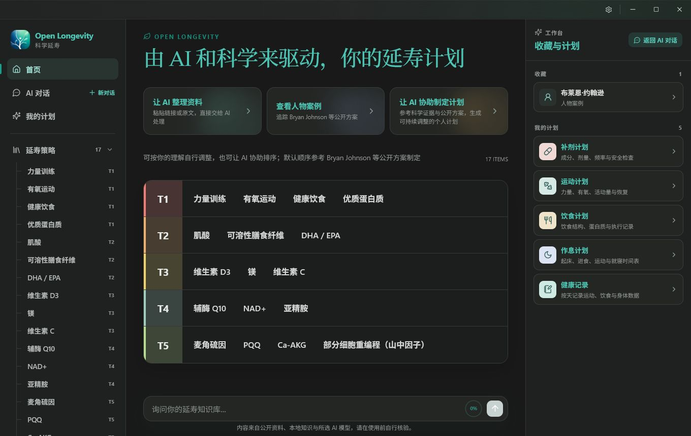
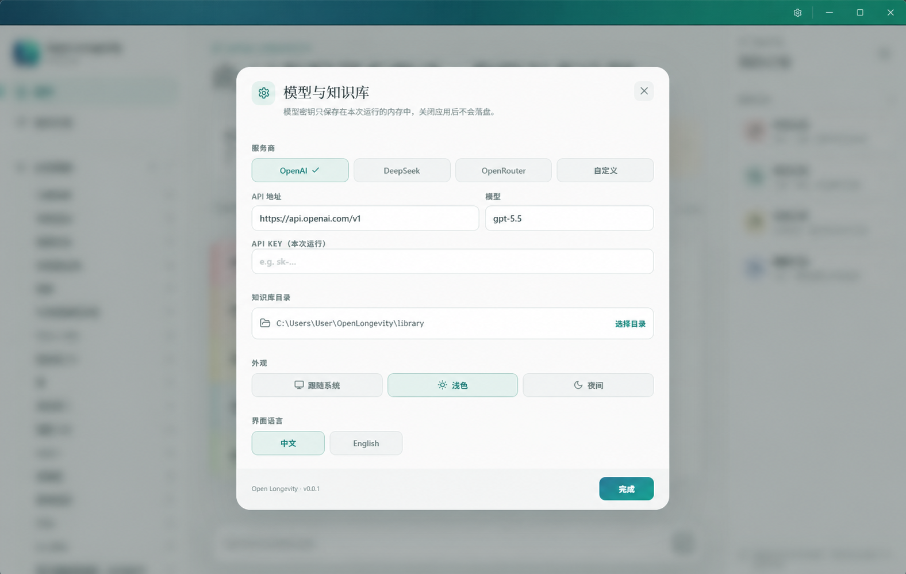

<p align="center">
  
</p>

<h1 align="center">Open Longevity · 开源长寿</h1>

<p align="center">
  <a href="README.md">English</a> · <strong>简体中文</strong>
</p>

<p align="center">
  <strong>科学长寿，不再是富豪专属。</strong><br>
  Open Longevity 以 Bryan Johnson 的延寿计划为蓝本。
</p>

<p align="center">
  中文 · English · Windows · macOS · Linux
</p>

<p align="center">
  <a href="https://github.com/edison7009/OpenLongevity/releases/latest"><strong>下载最新版</strong></a> · <a href="https://edison7009.github.io/OpenLongevity/">项目网站</a>
</p>

> 富豪可以组建医疗团队、持续追踪指标、整理研究并迭代个人方案。<br>
> 普通人同样应该拥有理解科学证据、管理个人知识和使用 AI 工具的权利。

Open Longevity 希望把散落在论文、公开人物方案和个人记录中的长寿知识，变成每个人都能阅读、核查、积累和使用的开放工具。它不兜售“永生捷径”，也不把昂贵方案简单复制给所有人；它提供的是一套透明、可追溯、可在本地掌控的科学长寿工作台。

## 为什么做 Open Longevity

今天的长寿科技存在明显的信息落差：

- 最新研究、检测和干预方案往往首先服务于少数高净值人群；
- 公开信息分散在论文、播客、新闻、社交媒体和人物协议中；
- 普通人很难区分证据、推测、营销和个体经验；
- 通用 AI 能回答问题，却通常不了解用户长期积累的本地资料；
- 健康数据极其私密，不应该默认被锁进某个平台。

我们的答案是：

1. **开放知识**：用 Markdown 和 CSV 保存资料，不制造封闭数据孤岛；
2. **可验证证据**：保留来源、研究限制和待核查事项，不把故事包装成因果；
3. **开源工具**：让功能、安全边界和演进方向都能被检查和共同改进；
4. **本地优先**：知识库默认保存在自己的电脑，API Key 不写入磁盘；
5. **AI 为人服务**：AI 帮助整理、检索和理解，而不是替代医生或替用户做医疗决定。

## 现在可以做什么

### 阅读一套开放的双语长寿知识库

- 内置 **84 份中文资料和 84 份英文配套资料**；
- 覆盖力量训练、有氧运动、健康饮食、肌酸、Omega-3、维生素、NAD+ 等策略；
- 收录 Bryan Johnson 等公开人物案例，以及地区和文化中的长寿观察；
- 通过 T1–T5 地图快速了解不同策略的优先级与证据成熟度；
- 支持文章之间的本地链接、外部来源和收藏。

T1–T5 是用于阅读和讨论的起始框架，不是适用于所有人的医疗排名。

### 把网页和原始资料交给 AI

粘贴公开网页链接、论文摘要、网页正文或临时笔记，Open Longevity 会：

1. 提取可读正文；
2. 让你配置的 OpenAI-compatible 模型生成结构化 Markdown 草稿；
3. 展示标题、主要发现、限制和待核查事项；
4. 由你修改并确认；
5. 保存到本地知识库的 `inbox/`。

应用会限制网页大小和请求时间，并阻止本机、局域网地址被网页收录功能访问。

## 界面预览

### 首页与长寿策略地图



### 模型与本地知识库



### 基于自己的本地资料与 AI 对话

AI 回答会优先参考：

1. 当前打开的文章；
2. 个人档案、当前方案和记录；
3. 与问题相关的本地知识笔记；
4. 模型自身的通用知识。

当回答依赖本地资料时，应用会要求模型保留对应的笔记路径，帮助用户继续核查。

对于论文、证据和临床试验类问题，Open Longevity 还会生成排除个人标识与个人测量值的英文医学检索式，
实时查询 PubMed、ClinicalTrials.gov 与 bioRxiv。程序会附上确定的 PMID、NCT
和预印本链接，并要求模型区分正式论文、试验登记/结果以及未经同行评审的预印本。

### 保持数据可控

- 默认知识库完全独立，不依赖任何开发者私人目录；
- 资料使用普通 Markdown/CSV，可迁移、可备份、可用其他工具打开；
- API Key 只存在于当前运行内存，关闭应用后不会保留；
- 只有用户主动发起 AI 请求时，相关内容才会发送给所配置的模型服务商；
- 触发科研检索时，发送给公共科学数据库的只有精简后的医学检索式；
- 不向模型开放 Shell，也不允许任意文件系统写入。

## 默认知识库位置

首次启动时，应用会自动创建自己的本地资料库：

| 平台 | 默认目录 |
| --- | --- |
| Windows | `%LOCALAPPDATA%\OpenLongevity\library` |
| macOS | `~/Library/Application Support/OpenLongevity/library` |
| Linux | `$XDG_DATA_HOME/OpenLongevity/library`，通常为 `~/.local/share/OpenLongevity/library` |

也可以在设置中主动选择其他目录。

## 技术栈

- [Tauri 2](https://tauri.app/)：跨平台桌面壳和本地权限边界；
- React + TypeScript + Vite：桌面界面；
- Rust：本地知识库、路径安全、网页收录和模型请求；
- Markdown + CSV：开放、可迁移的知识格式；
- OpenAI-compatible API：支持不同服务商和自定义端点。

```text
React UI
   │
   ▼
Tauri commands
   ├── Local Markdown library
   ├── Safe webpage capture
   ├── Lightweight local retrieval
   └── OpenAI-compatible provider
```

更多设计取舍见 [架构说明](docs/ARCHITECTURE.md)，双语资料维护规则见
[Bilingual starter library](docs/BILINGUAL_LIBRARY.md)。

## 本地开发

### 环境要求

- Node.js 当前 LTS 版本与 npm；
- Rust toolchain；
- 对应平台的 [Tauri prerequisites](https://v2.tauri.app/start/prerequisites/)。

### 启动

克隆仓库后：

```powershell
cd OpenLongevity
npm install
npm run library:check
npm run tauri:dev
```

仅启动浏览器界面预览：

```powershell
npm run dev
```

生产构建：

```powershell
npm run tauri:build
```

## 发布与验证

仓库中的 `.github/workflows/release.yml` 可以为 Windows x64、Linux x64、macOS Apple Silicon 和 macOS Intel 构建安装包。

发布前运行：

```powershell
npm run library:check
npm run release:check
npm run typecheck
npm run build
cargo fmt --check --manifest-path src-tauri/Cargo.toml
cargo test --manifest-path src-tauri/Cargo.toml
```

推送与应用版本一致的标签后，GitHub Actions 会创建对应 Release：

```bash
git tag vX.Y.Z
git push origin vX.Y.Z
```

正式发布 macOS 版本前，仍需配置 Apple Developer ID 签名和公证。

## 路线图

- 更成熟的个人长寿计划与周期复盘；
- 更广泛的 DOI、OpenAlex 与靶点研究连接器；
- 本地全文检索和更透明的证据引用；
- 可审计的健康指标时间线；
- 社区共同维护的策略、人物和研究资料；
- 更完整的无障碍与跨平台体验。

## 参与贡献

欢迎提交 Issue、Pull Request、资料勘误、英文翻译和产品建议。

贡献科学内容时，请：

- 保留原始来源、数字、单位和研究对象；
- 明确区分人体研究、动物研究、机制推测和个体经验；
- 不强化原文没有表达的因果结论；
- 同步维护中文文件和对应的 `.en.md` 文件；
- 不提交真实 API Key、个人健康记录或其他敏感数据。

## 医疗免责声明

Open Longevity 是知识整理与研究辅助工具，不提供诊断、处方或个体化医疗建议。任何涉及药物、补充剂、检测和干预的决定，都应结合个人情况并咨询合格的医疗专业人员。公开人物的方案只适用于理解和研究，不应直接照搬。

## License

[MIT](LICENSE) © 2026 Open Longevity contributors.

---

### English summary

**Longevity science should not be reserved for the wealthy.**

Open Longevity is an open-source, local-first desktop workspace for reading scientific longevity knowledge, organizing public research with AI, and asking questions grounded in your own Markdown library. It supports Chinese and English, OpenAI-compatible providers, and Windows, macOS, and Linux.

Your library stays on your computer by default, and your API key is kept only in memory for the current run. Open Longevity is a knowledge and research tool—not medical advice.
